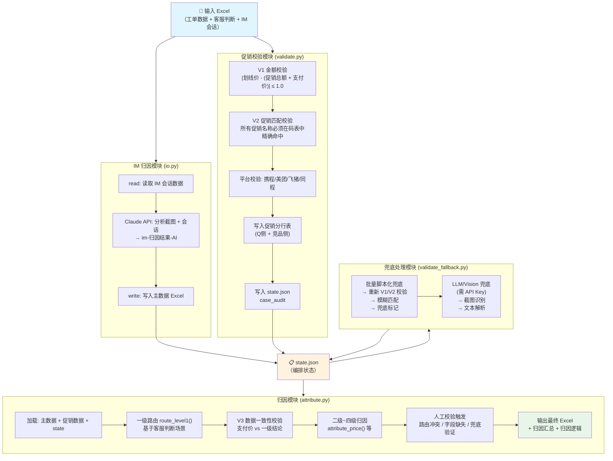
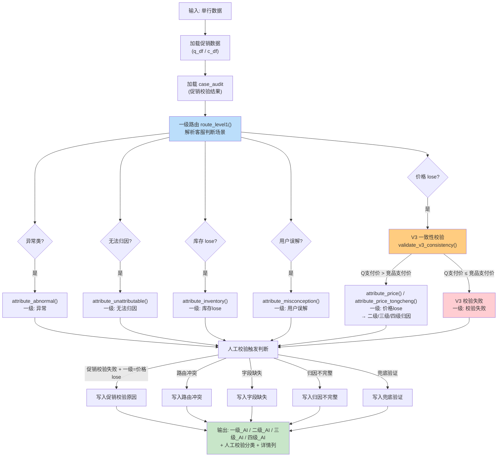
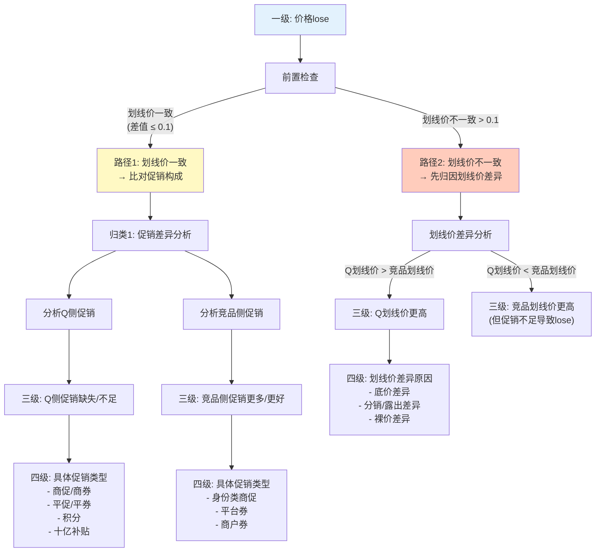
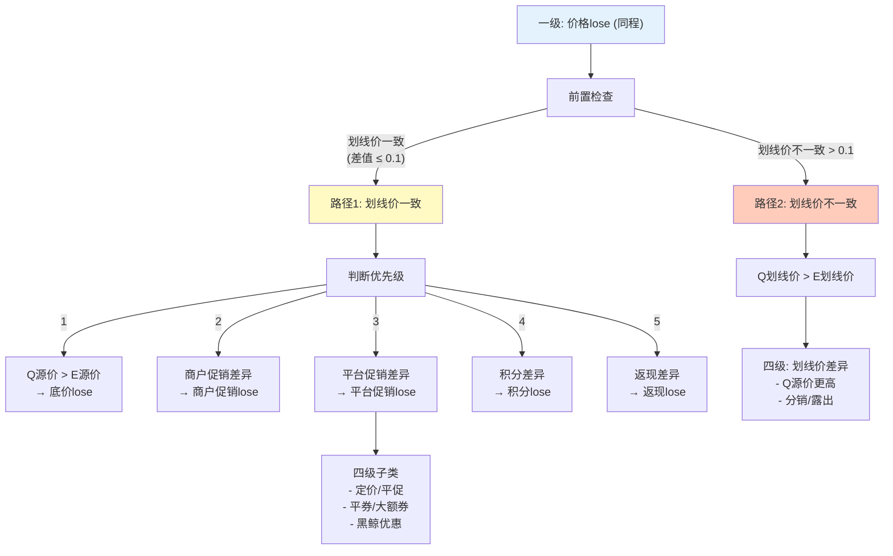
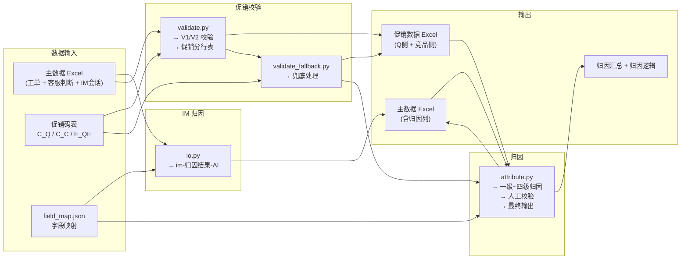
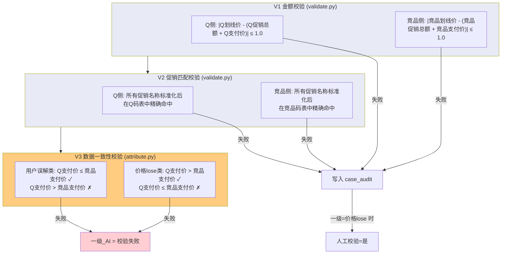

# 比价归因流程图

## 一、模块级流水线

```mermaid
flowchart TD
    INPUT["📄 输入 Excel\n（工单数据 + 客服判断 + IM会话）"]
    STATE["📋 state.json\n（编排状态）"]

    INPUT --> IM
    INPUT --> PROMO

    subgraph IM["IM 归因模块 (io.py)"]
        IM_READ["read: 读取 IM 会话数据"]
        IM_CLAUDE["Claude API: 分析截图 + 会话\n→ im-归因结果-AI"]
        IM_WRITE["write: 写入主数据 Excel"]
        IM_READ --> IM_CLAUDE --> IM_WRITE
    end

    subgraph PROMO["促销校验模块 (validate.py)"]
        V1["V1 金额校验\n|划线价 - (促销总额 + 支付价)| ≤ 1.0"]
        V2["V2 促销匹配校验\n所有促销名称必须在码表中精确命中"]
        PLATFORM["平台校验: 携程/美团/飞猪/同程"]
        PROMO_FILE["写入促销分行表\n(Q侧 + 竞品侧)"]
        AUDIT["写入 state.json\ncase_audit"]
        V1 --> V2 --> PLATFORM --> PROMO_FILE --> AUDIT
    end

    IM_WRITE --> STATE
    AUDIT --> STATE

    STATE --> FALLBACK
    STATE --> ATTRIBUTION

    subgraph FALLBACK["兜底处理模块 (validate_fallback.py)"]
        BATCH["批量脚本化兜底\n→ 重新 V1/V2 校验\n→ 模糊匹配\n→ 兜底标记"]
        LLM["LLM/Vision 兜底\n(需 API Key)\n→ 截图识别\n→ 文本解析"]
        BATCH --> LLM
    end

    FALLBACK --> STATE

    subgraph ATTRIBUTION["归因模块 (attribute.py)"]
        LOAD["加载: 主数据 + 促销数据 + state"]
        L1["一级路由 route_level1()\n基于客服判断场景"]
        V3["V3 数据一致性校验\n支付价 vs 一级结论"]
        L234["二级~四级归因\nattribute_price() 等"]
        HUMAN["人工校验触发\n路由冲突 / 字段缺失 / 兜底验证"]
        OUTPUT["输出最终 Excel\n+ 归因汇总 + 归因逻辑"]
        LOAD --> L1 --> V3 --> L234 --> HUMAN --> OUTPUT
    end

    style INPUT fill:#e1f5fe
    style STATE fill:#fff3e0
    style OUTPUT fill:#e8f5e9
```

---

## 二、归因主逻辑详细流程

```mermaid
flowchart TD
    ROW["输入: 单行数据"]
    LOAD_PROMO["加载促销数据\n(q_df / c_df)"]
    CASE_AUDIT["加载 case_audit\n(促销校验结果)"]

    ROW --> LOAD_PROMO --> CASE_AUDIT --> L1

    L1["一级路由 route_level1()\n解析客服判断场景"]
    
    L1 --> ABNORMAL{"异常类?"}
    ABNORMAL -->|"是"| ATTR_ABNORMAL["attribute_abnormal()\n一级: 异常"]
    
    L1 --> UNATTRIBUTABLE{"无法归因?"}
    UNATTRIBUTABLE -->|"是"| ATTR_UN["attribute_unattributable()\n一级: 无法归因"]
    
    L1 --> INVENTORY{"库存 lose?"}
    INVENTORY -->|"是"| ATTR_INV["attribute_inventory()\n一级: 库存lose"]

    L1 --> MISCONCEPTION{"用户误解?"}
    MISCONCEPTION -->|"是"| ATTR_MIS["attribute_misconception()\n一级: 用户误解"]

    L1 --> PRICE{"价格 lose?"}
    PRICE -->|"是"| V3_CHECK

    V3_CHECK["V3 一致性校验\nvalidate_v3_consistency()"]
    V3_CHECK -->|"Q支付价 > 竞品支付价"| ATTR_PRICE["attribute_price() / attribute_price_tongcheng()\n一级: 价格lose\n→ 二级/三级/四级归因"]
    V3_CHECK -->|"Q支付价 ≤ 竞品支付价"| V3_FAIL["V3 校验失败\n一级: 校验失败"]

    ATTR_ABNORMAL --> HUMAN_CHECK
    ATTR_UN --> HUMAN_CHECK
    ATTR_INV --> HUMAN_CHECK
    ATTR_MIS --> HUMAN_CHECK
    ATTR_PRICE --> HUMAN_CHECK
    V3_FAIL --> HUMAN_CHECK

    HUMAN_CHECK["人工校验触发判断"]
    HUMAN_CHECK -->|"促销校验失败 + 一级=价格lose"| WRITE_PROMO["写入促销校验原因"]
    HUMAN_CHECK -->|"路由冲突"| WRITE_CONFLICT["写入路由冲突"]
    HUMAN_CHECK -->|"字段缺失"| WRITE_MISSING["写入字段缺失"]
    HUMAN_CHECK -->|"归因不完整"| WRITE_INCOMPLETE["写入归因不完整"]
    HUMAN_CHECK -->|"兜底验证"| WRITE_FALLBACK["写入兜底验证"]

    WRITE_PROMO --> FINAL
    WRITE_CONFLICT --> FINAL
    WRITE_MISSING --> FINAL
    WRITE_INCOMPLETE --> FINAL
    WRITE_FALLBACK --> FINAL

    FINAL["输出: 一级_AI / 二级_AI / 三级_AI / 四级_AI\n+ 人工校验分类 + 详情列"]

    style L1 fill:#bbdefb
    style V3_CHECK fill:#ffcc80
    style V3_FAIL fill:#ffcdd2
    style FINAL fill:#c8e6c9
```

---

## 三、价格 lose 归因树（携程场景）

```mermaid
flowchart TD
    PRICE["一级: 价格lose"]
    
    PRICE --> PRECHECK["前置检查"]
    PRECHECK -->|"划线价一致\n(差值 ≤ 0.1)"| PATH1["路径1: 划线价一致\n→ 比对促销构成"]
    PRECHECK -->|"划线价不一致 > 0.1"| PATH2["路径2: 划线价不一致\n→ 先归因划线价差异"]

    PATH1 --> CAT1["归类1: 促销差异分析"]
    CAT1 --> Q_PROMO["分析Q侧促销"]
    CAT1 --> C_PROMO["分析竞品侧促销"]

    Q_PROMO --> L3_Q["三级: Q侧促销缺失/不足"]
    C_PROMO --> L3_C["三级: 竞品侧促销更多/更好"]

    L3_Q --> L4_1["四级: 具体促销类型\n- 商促/商券\n- 平促/平券\n- 积分\n- 十亿补贴"]
    L3_C --> L4_2["四级: 具体促销类型\n- 身份类商促\n- 平台券\n- 商户券"]

    PATH2 --> PRICE_DIFF["划线价差异分析"]
    PRICE_DIFF -->|"Q划线价 > 竞品划线价"| Q_HIGHER["三级: Q划线价更高"]
    PRICE_DIFF -->|"Q划线价 < 竞品划线价"| C_HIGHER["三级: 竞品划线价更高\n(但促销不足导致lose)"]

    Q_HIGHER --> L4_3["四级: 划线价差异原因\n- 底价差异\n- 分销/露出差异\n- 裸价差异"]

    style PRICE fill:#e3f2fd
    style PATH1 fill:#fff9c4
    style PATH2 fill:#ffccbc
```

---

## 四、价格 lose 归因树（同程场景）

```mermaid
flowchart TD
    PRICE_TC["一级: 价格lose (同程)"]
    
    PRICE_TC --> PRECHECK_TC["前置检查"]
    PRECHECK_TC -->|"划线价一致\n(差值 ≤ 0.1)"| PATH1_TC["路径1: 划线价一致"]
    PRECHECK_TC -->|"划线价不一致 > 0.1"| PATH2_TC["路径2: 划线价不一致"]

    PATH1_TC --> JUDGE["判断优先级"]
    JUDGE -->|"1"| BASE_PRICE["Q源价 > E源价\n→ 底价lose"]
    JUDGE -->|"2"| MERCHANT["商户促销差异\n→ 商户促销lose"]
    JUDGE -->|"3"| PLATFORM["平台促销差异\n→ 平台促销lose"]
    JUDGE -->|"4"| POINTS["积分差异\n→ 积分lose"]
    JUDGE -->|"5"| CASHBACK["返现差异\n→ 返现lose"]

    PLATFORM --> L4_TC["四级子类\n- 定价/平促\n- 平券/大额券\n- 黑鲸优惠"]

    PATH2_TC --> Q_HIGHER_TC["Q划线价 > E划线价"]
    Q_HIGHER_TC --> L4_SOURCE["四级: 划线价差异\n- Q源价更高\n- 分销/露出"]

    style PRICE_TC fill:#e3f2fd
    style PATH1_TC fill:#fff9c4
    style PATH2_TC fill:#ffccbc
```

---

## 五、完整数据流

```mermaid
flowchart LR
    subgraph INPUT["数据输入"]
        EXCEL["主数据 Excel\n(工单 + 客服判断 + IM会话)"]
        CODE_TABLES["促销码表\nC_Q / C_C / E_QE"]
        FIELD_MAP["field_map.json\n字段映射"]
    end

    subgraph IM["IM 归因"]
        IM_PROC["io.py\n→ im-归因结果-AI"]
    end

    subgraph PROMO["促销校验"]
        VALIDATE["validate.py\n→ V1/V2 校验\n→ 促销分行表"]
        FALLBACK["validate_fallback.py\n→ 兜底处理"]
    end

    subgraph ATTR["归因"]
        ATTRIBUTE["attribute.py\n→ 一级~四级归因\n→ 人工校验\n→ 最终输出"]
    end

    subgraph OUTPUT["输出"]
        MAIN["主数据 Excel\n(含归因列)"]
        PROMO_XLSX["促销数据 Excel\n(Q侧 + 竞品侧)"]
        SUMMARY["归因汇总 + 归因逻辑"]
    end

    EXCEL --> IM_PROC
    EXCEL --> VALIDATE
    CODE_TABLES --> VALIDATE
    CODE_TABLES --> FALLBACK
    FIELD_MAP --> IM_PROC
    FIELD_MAP --> ATTRIBUTE

    IM_PROC --> MAIN
    VALIDATE --> PROMO_XLSX
    VALIDATE --> FALLBACK
    FALLBACK --> PROMO_XLSX
    FALLBACK --> ATTRIBUTE

    MAIN --> ATTRIBUTE
    PROMO_XLSX --> ATTRIBUTE
    ATTRIBUTE --> MAIN
    ATTRIBUTE --> SUMMARY
```

---

## 六、校验体系

```mermaid
flowchart TD
    subgraph V1["V1 金额校验 (validate.py)"]
        V1_Q["Q侧: |Q划线价 - (Q促销总额 + Q支付价)| ≤ 1.0"]
        V1_C["竞品侧: |竞品划线价 - (竞品促销总额 + 竞品支付价)| ≤ 1.0"]
    end

    subgraph V2["V2 促销匹配校验 (validate.py)"]
        V2_Q["Q侧: 所有促销名称标准化后\n在Q码表中精确命中"]
        V2_C["竞品侧: 所有促销名称标准化后\n在竞品码表中精确命中"]
    end

    subgraph V3["V3 数据一致性校验 (attribute.py)"]
        V3_R1["用户误解类: Q支付价 ≤ 竞品支付价 ✓\nQ支付价 > 竞品支付价 ✗"]
        V3_R2["价格lose类: Q支付价 > 竞品支付价 ✓\nQ支付价 ≤ 竞品支付价 ✗"]
    end

    V1 --> V2
    V2 --> V3

    V1_Q -->|"失败"| CASE_AUDIT["写入 case_audit"]
    V1_C -->|"失败"| CASE_AUDIT
    V2_Q -->|"失败"| CASE_AUDIT
    V2_C -->|"失败"| CASE_AUDIT
    V3_R1 -->|"失败"| V3_FAIL["一级_AI = 校验失败"]
    V3_R2 -->|"失败"| V3_FAIL

    CASE_AUDIT -->|"一级=价格lose 时"| HUMAN["人工校验=是"]

    style V1 fill:#e8eaf6
    style V2 fill:#e8eaf6
    style V3 fill:#ffcc80
    style V3_FAIL fill:#ffcdd2
```